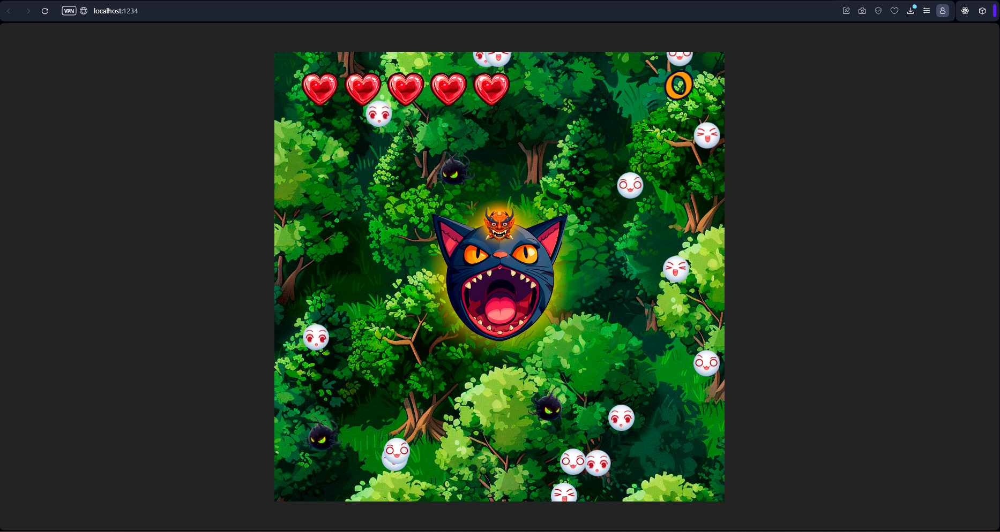

# Herdsman

Hello there!

It is demo of simple game where player have to catch some collectibles entities



## Installation

Before you try this masterpiece firstly clone this repo

```bash
git clone git@github.com:fimshagal/Herdsman.git
```

After go into repo-folder and run these commands with your fav package manager

#### Npm

```bash
npm install
```

```bash
npm run start
```

#### Pnpm

```bash
pnpm install
```

```bash
pnpm start
```

